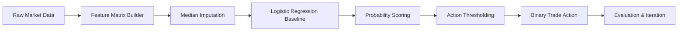

# Jane Street Market Prediction Portfolio


A portfolio-grade, end-to-end baseline for the **Jane Street Market Prediction** challenge, designed to demonstrate strong data science engineering practices:

- reproducible feature engineering
- interpretable baseline modeling
- test-first utility functions
- clear project narrative for hiring managers and collaborators

---

## Project Highlights

- **Competition context:** binary action prediction on anonymized financial features.
- **Engineering focus:** clean Python modules extracted from experimental notebook workflows.
- **Production habits:** requirements pinning, modular APIs, and pytest coverage.

---

## Workflow Architecture



---

## Repository Structure

```text
.
├── janestreet.ipynb                    # Original exploration notebook
├── requirements.txt                    # Runtime and testing dependencies
├── src/
│   └── jane_street_portfolio/
│       ├── __init__.py                 # Public package API
│       ├── features.py                 # Feature selection + imputation
│       └── modeling.py                 # Baseline training + action generation
└── tests/
    ├── test_features.py                # Feature module tests
    └── test_modeling.py                # Modeling module tests
```

---

## Quickstart

```bash
python -m venv .venv
source .venv/bin/activate
pip install -r requirements.txt
export PYTHONPATH=src
pytest -q
```

---

## Why This Portfolio Project Works

This repository intentionally balances **research agility** (notebook exploration) with **software rigor** (typed, documented, and tested utilities). It can be expanded with:

1. time-aware cross-validation,
2. utility-score optimization,
3. model ensembles,
4. experiment tracking (MLflow / Weights & Biases),
5. deployment packaging for batch inference.

---

## License

MIT License. See `LICENSE` for details.
